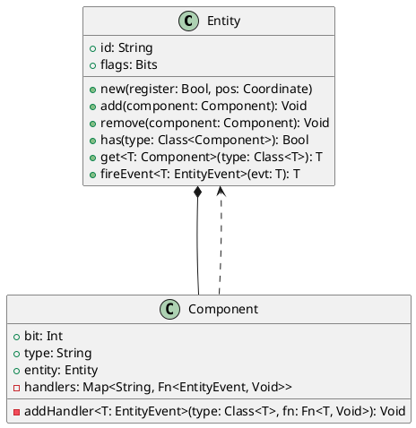

# ECS

Everything in the game world is represented by an Entity.

```puml
@startuml ECS Classes

    class Entity {
        + id: String
        + flags: Bits

        + new(register: Bool, pos: Coordinate)
        + add(component: Component): Void
        + remove(component: Component): Void
        + has(type: Class<Component>): Bool
        + get<T: Component>(type: Class<T>): T
        + fireEvent<T: EntityEvent>(evt: T): T
    }

    class Component {
        + bit: Int
        + type: String
        + entity: Entity
        - handlers: Map<String, Fn<EntityEvent, Void>>
        - addHandler<T: EntityEvent>(type: Class<T>, fn: Fn<T, Void>): Void
    }

    Entity *-- Component
    Component --.> Entity

@enduml
```
